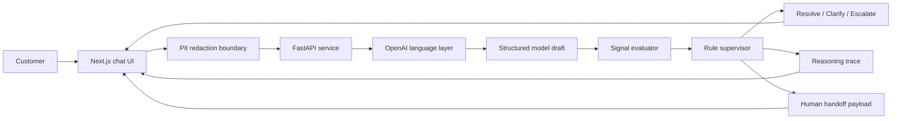

# Fraud Dispute Agent Reference Architecture

## Executive Summary

This project demonstrates a regulated-agent pattern for credit-card dispute handling. The visible product is a customer support chat. The important system is the decision machinery behind it: PII boundaries, structured model proposals, deterministic supervision, auditable traces, and human handoff payloads.

The demo is designed to show two complementary concerns:

- Product workflow: journeys, guardrails, traces, compliance posture, and human handoff design.
- Deployment architecture: a Next.js reference app using Vercel AI SDK `useChat`, a clear backend boundary, and production-oriented environment handling.

Short description:

> A dispute journey supervisor that uses an LLM for language and reserves final regulated decision authority for deterministic policy code.

## Distinguishing Factor

This system adds the pieces a regulated operation would need:

- Decision separation: the model proposes; the supervisor decides.
- PII boundary: sensitive identifiers are redacted before model processing.
- Structured output: the model must return a scenario, action, rationale, and optional clarifying questions.
- Independent signal checks: Python recomputes transaction evidence from the case context.
- Guardrail overrides: policy code can replace the model’s proposed outcome.
- Audit trace: every decision returns signals, confidence, rule version, rationale, overrides, and an audit id.
- Operational handoff: escalations include transaction data, signal analysis, confidence, and transcript.

The key product judgment is that the model is useful for language, while policy authority belongs in code that can be inspected and tested.

## System Diagram



## Layer Responsibilities

### Frontend Layer

The Next.js frontend owns the customer experience and the demo console:

- Presents a calm dispute chat interface.
- Lets the user switch between demo cases.
- Redacts obvious sensitive identifiers before forwarding the request.
- Uses Vercel AI SDK `useChat` to manage messages, submit status, and the chat request.
- Receives the approved reply as an AI SDK UI message stream.
- Receives the supervisor trace as a `data-trace` part in that stream.
- Sends the dispute request to the backend.
- Renders the final customer reply.
- Shows the journey trace, signal checks, supervisor overrides, and handoff payload.

The UI is intentionally split: the left side feels like support chat, while the right side exposes the system behavior an operator, reviewer, or builder would need to inspect.

### Language Layer

The OpenAI-backed language layer handles flexible natural-language work:

- Reads the customer message and recent conversation history.
- Consumes structured transaction context.
- Proposes one of three scenarios.
- Recommends an action.
- Drafts a customer-facing reply.
- Suggests clarifying questions when needed.

The language layer drafts the decision package. The supervisor makes the final regulated decision.

### Policy Supervisor Layer

The Python supervisor owns the decision boundary:

- Recomputes all signal checks from transaction context.
- Applies deterministic guardrails.
- Overrides the model when policy requires it.
- Calculates confidence from signal separation.
- Returns the rule version used at decision time.
- Creates a human handoff payload when escalation is required.

This is the core architecture choice.

## Scenario Model

### Scenario 1: Straightforward

The charge strongly matches legitimate transaction context.

Example:

- Merchant strongly matches a known recurring merchant.
- Amount is consistent.
- Currency and country are expected.
- No explicit risk signal is present.

Outcome: resolve.

### Scenario 2: Ambiguous

The evidence does not point clearly toward legitimate or fraudulent.

Example:

- Merchant partially matches a known subscription.
- Amount changed materially.
- No lost or stolen card report exists.
- No explicit high-risk cluster is present.

Outcome: ask a clarifying question.

### Scenario 3: Likely Fraud

The transaction has explicit risk signals.

Example:

- Lost or stolen card report exists.
- Merchant category is on an explicit risk list.
- Transaction is cross-border or currency-mismatched.
- There is a cluster of unfamiliar charges.

Outcome: escalate to a human specialist.

## Signal Checks

The supervisor checks seven signals on every request:

1. Merchant match against known transaction context.
2. Merchant category risk.
3. Recent lost or stolen card report.
4. Cluster of unfamiliar charges.
5. Cross-border versus domestic transaction.
6. Recurring versus one-time transaction.
7. Transaction currency versus account currency.

Important compliance posture:

- Prior dispute behavior is not used as a signal.
- Customer “suspiciousness” is not modeled.
- Unfamiliar merchant alone is ambiguous, not fraud.
- Partial merchant match with changed amount is ambiguous, not fraud.

The system evaluates the transaction and its context, not the customer as a person.

## Guardrail Overrides

A guardrail override happens when the model proposes one outcome and the supervisor replaces it with another.

Example: the model is too cautious.

```text
Model proposal: ask a clarifying question.
Supervisor evidence: strong known merchant match, normal amount, recurring, no risk signals.
Final outcome: resolve.
```

Example: the model escalates too aggressively.

```text
Model proposal: escalate.
Supervisor evidence: unfamiliar merchant only, no lost card report, no risky category, no cluster.
Final outcome: ask a clarifying question.
```

Example: the model under-escalates.

```text
Model proposal: ask a clarifying question.
Supervisor evidence: lost or stolen card report.
Final outcome: escalate.
```

The operational point:

> The model can be persuasive. Policy must be enforceable, inspectable, and testable.

## Reasoning Trace

Each backend response includes:

- Final scenario.
- Final recommended action.
- Signal checks.
- Computed confidence.
- Rule version.
- Model rationale.
- Supervisor overrides.
- Audit id.
- Optional handoff payload.

This trace gives reviewers the material they need for audit review, debugging, evaluation, and future policy changes.

## Audit Log

Every completed backend decision writes a SQLite audit record. The record stores:

- The model's original proposed scenario and action.
- The final scenario and action.
- Customer and transaction identifiers.
- Signal checks.
- Supervisor overrides.
- Redactions.
- Rule version.
- Full request and response snapshots.

Local development writes to `audit_log.sqlite3` by default. Railway should set `AUDIT_DB_PATH` to a persistent file location, or the same schema can move to Postgres before real traffic.

## Handoff Payload

When escalation is required, the system returns:

- Transaction details.
- Signal analysis.
- Confidence.
- Transcript.
- Summary.

The goal is to avoid a bad handoff where the customer has to repeat the entire story to a human specialist.

## Brand Posture

The app uses a neutral demo identity. It should not use official Sierra or Vercel marks unless authorization exists.

The design intent is:

- Sierra-aware in operating model: journeys, traces, supervisor layer, handoff, guardrails.
- Vercel-aware in implementation: Next.js, TypeScript, deployable app structure, clean environment boundaries.
- Neutral in branding: no implied partnership, endorsement, or official product status.

## Deployment

Frontend:

- Platform: Vercel.
- Directory: `frontend/`.
- Environment variable: `BACKEND_URL`.
- Chat state: Vercel AI SDK `useChat`.
- Response protocol: AI SDK UI message stream with a `data-trace` part.

Backend:

- Platform: Railway.
- Directory: `backend/`.
- Environment variables: `OPENAI_API_KEY`, `OPENAI_MODEL`, `ALLOWED_ORIGINS`, `AUDIT_DB_PATH`.
- Health route: `GET /health`.
- API route: `POST /api/dispute`.
- Evaluation route: `GET /api/evaluations`.

## Evaluation Harness

The build includes a controlled evaluation harness. It runs seeded dispute cases where the model draft can be intentionally wrong, then checks whether the supervisor returns the expected final decision.

The panel reports:

- Expected scenario.
- Actual scenario.
- Expected action.
- Actual action.
- Whether the supervisor overrode the model.
- Which guardrail fired.
- Whether the handoff payload was complete.
- Whether PII was redacted.

Current eval cases:

- Known recurring merchant, normal amount.
- Known recurring merchant, changed amount.
- Unknown merchant, no other risk signal.
- Lost or stolen card report.

Recommended future eval cases:

- Unknown merchant plus risky category.
- Cross-border transaction with currency mismatch.
- Cluster of unfamiliar charges.
- Legal merchant name mismatch.
- Payment processor alias.
- Mixed batch of recognized and unrecognized charges.

This makes the supervisor layer visible in a repeatable way during evaluation and review.

## Success Metrics

Operational metrics:

- Auto-resolution rate for straightforward cases.
- Clarification rate for ambiguous cases.
- Escalation accuracy for likely-fraud cases.
- False escalation rate.
- Guardrail override rate.
- PII redaction coverage.
- Handoff completeness.
- Average time to first response.

These metrics focus on safe operation, customer experience, and automation quality.

## Architecture Summary

Short version:

The LLM handles the language layer. The decision layer recomputes evidence, enforces policy, produces a trace, and creates a handoff when the journey leaves automation.

Expanded version:

The key design decision is separating model fluency from policy authority. In financial services, a plausible answer is not enough. The system needs a deterministic supervisor, a rule version, inspectable signals, and a record of whether the model was overridden. That is what turns a chat interface into something closer to an operational agent.
